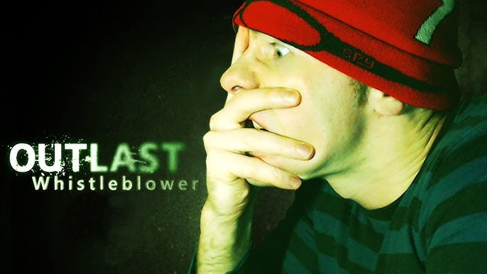
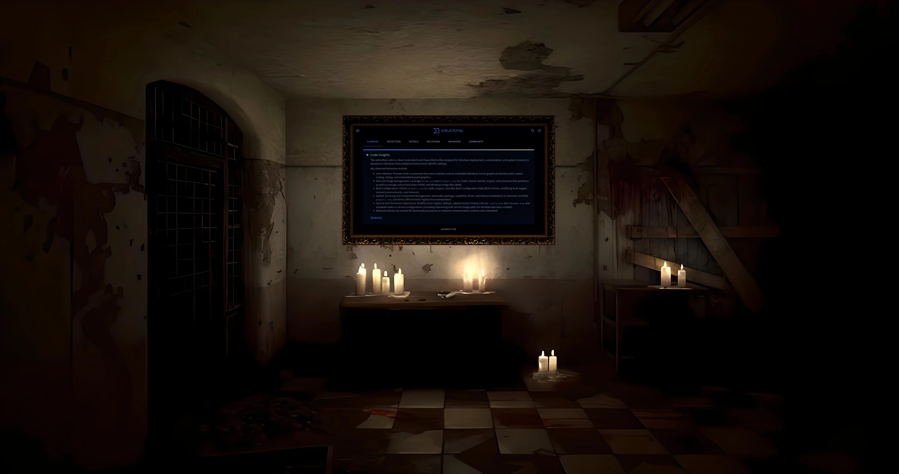

At the start of 2026, the five year milestone of my software development career had been reached. Realizing it wasn't going anywhere other than off a cliff due to the neverending attempts to destroy my life and reputation, the decision was made that nothing less than action such as this would suffice. One can only imagine the sheer number of developers who have went through this without so much as uttering a word. You're welcome.

Proceed if you dare

***What didn't happen***
- Zero acclaim or recognition from communities or professionals
- Zero media coverage, written or video content
- Zero job opportunities

***What did happen***
- Sabatoged and suffocated: Communities along with the tech-media in the software development sphere banded together to sabatoge my work and reputation, all the while using my tool as a golden-goose blueprint via mass scale ai-assisted theft
- Social engineered: Friends on social media and IRL were persuaded to join the harassment, including seemingly random incidents of violent crime committed against yours truly
- Weaponized vicinities: Home and places of work were compromised to further compound the devastation, featuring roommate induced in-home terror plots, and absurd reputationally damaging social encounters at work

***What's likely being overlooked***
- The overall equivalent of deleting a person's diploma in software engineering, operating system deployment, system automation, creation of a derivative scripting language, expert Windows system internals, and throwing the many years spent of blood sweat and tears down the drain, as well as lost friendships, living situations, and employment opportunities past present and future

***Are you exceptional? Prepare yourself for low-key attempted murder or assisted suicide, which ever you'd prefer calling it, by a world of self-loathing cretins***
- There's no redemption value whatsoever in the field of software development given it's current state. Every aspect of the entire scene is completely fake and artificially propped up. With nothing to gain and a whole lot to lose, starting a career in this field is nothing other than suicidal and masochistic. Good luck to you. 

